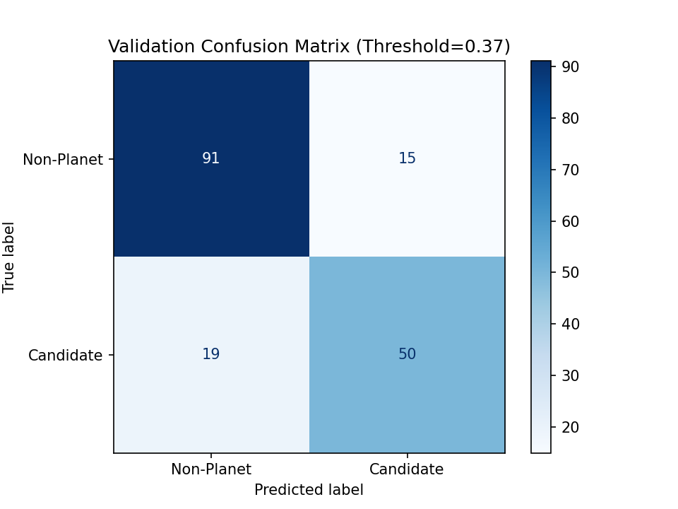
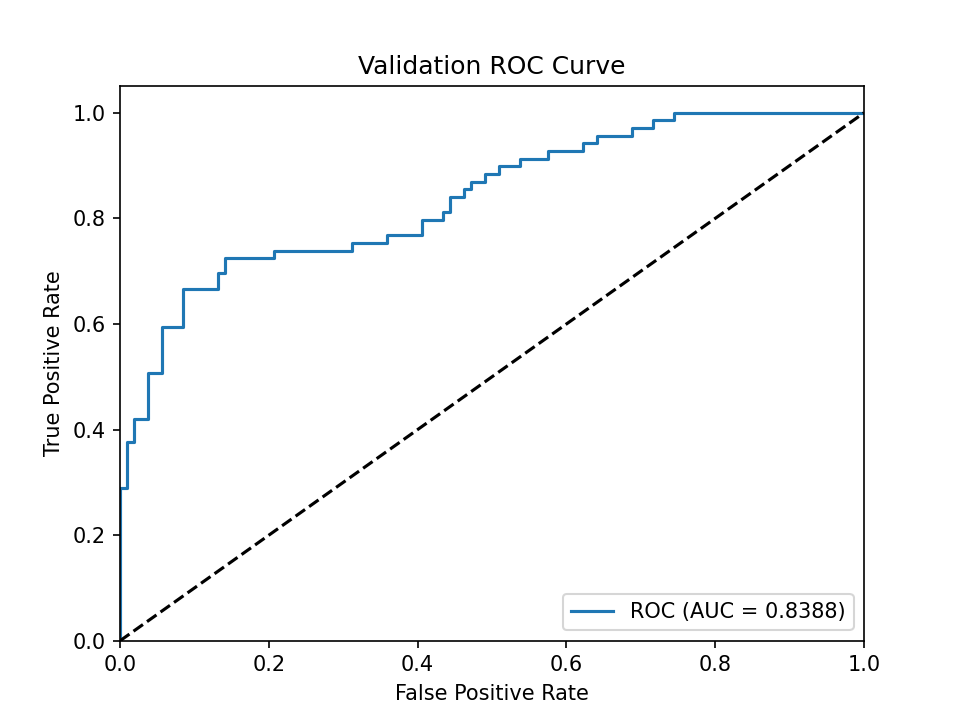
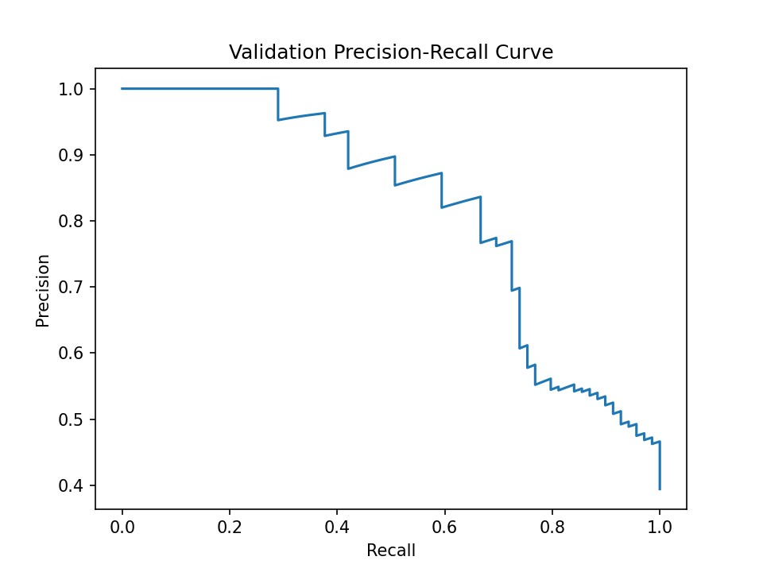
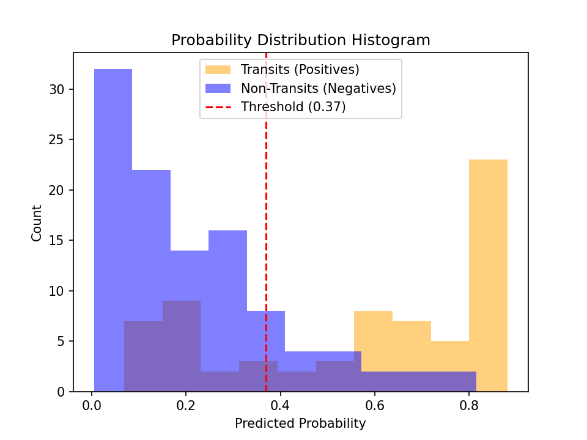

# STELSION V3 Experiment Report - Run 018_hybrid_adaptive_v2

## Meta Information & Reproducibility
- **Model Architecture**: hybrid
- **Total Parameters**: 172,627
- **Dataset Size**: 932 (Train: 757, Validation: 175)
- **Class Distribution**: 390 Positives, 542 Negatives
- **Training Time**: 1466.88 seconds
- **Best Epoch**: 80
- **Optimal Threshold**: **0.3700**
- **Git Commit**: a0339db
- **TensorFlow Version**: 2.21.0
- **Python Version**: 3.11.9
- **Random Seed**: 42

## Validation Metrics Summary
- **Accuracy**: 80.57%
- **Precision**: 0.7692
- **Recall**: 0.7246
- **F1 Score**: **0.7463**
- **ROC-AUC**: 0.8388

## Per-Class Metrics
- **Transit Precision**: 0.7692
- **Transit Recall**: 0.7246
- **Transit F1**: 0.7463
- **Non-Transit Precision**: 0.8273
- **Non-Transit Recall**: 0.8585

## Error Analysis (Validation Set Examples)
- **False Positives (15 examples)**: idx 6 (prob 0.375), idx 27 (prob 0.773), idx 36 (prob 0.458), idx 37 (prob 0.469), idx 45 (prob 0.648), idx 56 (prob 0.694), idx 78 (prob 0.707), idx 82 (prob 0.569), idx 97 (prob 0.635), idx 100 (prob 0.815)
- **False Negatives (19 examples)**: idx 9 (prob 0.159), idx 11 (prob 0.196), idx 13 (prob 0.147), idx 19 (prob 0.229), idx 20 (prob 0.323), idx 21 (prob 0.222), idx 68 (prob 0.113), idx 76 (prob 0.246), idx 94 (prob 0.075), idx 95 (prob 0.212)

## Evaluation Curves
### Confusion Matrix

### ROC Curve

### Precision-Recall Curve

### Probability Histogram

